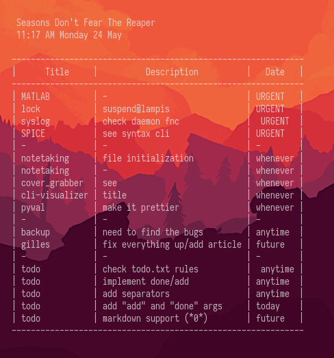

# Conky configuration

Pretty basic stuff. I just wanted to be able to *check* what is on my plate for the day so I wrote a small custom `todo` script to preview. It will be published when the transition from my *faulty* .csv method to the *tested* todo.txt method is complete.

Other than that it prints the title of a [loved song](https://www.youtube.com/watch?v=Dy4HA3vUv2c), as well as the current time and date.
